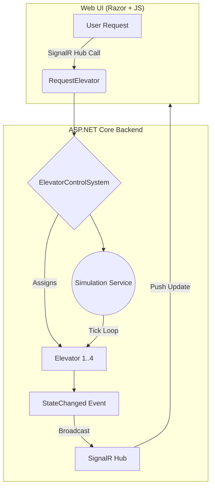

# Elevator Control System (C# / .NET)

A simple yet structured simulation of an **elementary elevator control system**, written in **C# (.NET)**.  
This project demonstrates core design principles — clean code, event-driven updates, asynchronous processing, and a minimal front-end with **SignalR** for real-time visualization.

---

## Overview

This system simulates **4 elevators** operating in a **10-floor building**.  
Elevators handle random and user-generated requests, moving passengers between floors with realistic timing rules:

-  **10 seconds** to move between floors  
-  **10 seconds** to load/unload passengers  
-  **Directional persistence**: an elevator continues in its current direction until no more passengers need service that way  
-  A **simple assignment algorithm** picks the best elevator for each new request  

---

##  Architecture



---

## Running the Simulation

### 1. Clone the repository
```bash
git clone https://github.com/<your-username>/ElevatorApp.git
cd ElevatorApp
```

### 2. Run the web project
```bash
dotnet run --project ElevatorApp.Web
```

### 3. Open your browser
Visit the application at:
```
https://localhost:7076
```
### 4. Start the Simulation
Click **“Start Simulation”** to start booking elevator requests,  
or manually select floors and click **“Call Elevator”** to create your own.
